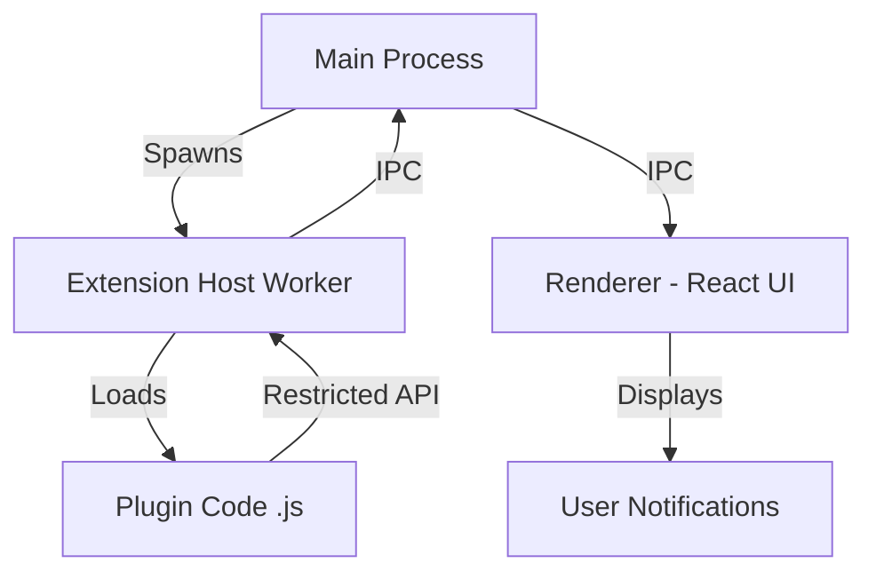

# 📑 JS Block - System Design & Core Architecture

Este documento descreve as decisões de design e as fundações arquitetônicas de alto nível que sustentam o **JS Block**, garantindo um ambiente de desenvolvimento profissional, seguro e escalável.

*This document outlines the high-level design decisions and architectural foundations that power **JS Block**, ensuring a professional, secure, and scalable development environment.*

---

## 🏗️ 1. Isolated Plugin System / Sistema de Plugins Isolado

Inspirado pelo VS Code, implementamos uma arquitetura de múltiplos processos para suportar plugins externos sem comprometer a segurança ou performance.

*Inspired by VS Code, we implemented a multi-process architecture to support external plugins without compromising security or performance.*

### Key Features / Recursos Principais:
*   **Extension Host Process**: O código do plugin roda em um processo separado (`utilityProcess`). Se um plugin travar, o editor continua funcionando. / *Plugin code runs in a separate process. If a plugin crashes, the editor remains stable.*
*   **Whitelist API**: Plugins interagem via o objeto global `jsBlock`. Não há acesso direto a APIs sensíveis do Node.js ou ao DOM. / *Plugins interact via the `jsBlock` global. No direct access to sensitive Node or DOM APIs.*
*   **Manifest Discovery**: Plugins são detectados automaticamente via arquivo `plugin.json`. / *Plugins are automatically detected via `plugin.json`.*

### Architecture / Arquitetura:

---

## 🎨 2. Premium Custom Dropdown / Seletor Customizado Premium

Substituímos os seletores padrão por um componente de dropdown customizado de alta fidelidade.

*Standard selects were replaced with a custom, high-fidelity dropdown component.*

### Technical Excellence / Excelência Técnica:
*   **React Portals**: Menus são renderizados fora da hierarquia do elemento pai, evitando cortes por `overflow: hidden`. / *Menus render outside parent hierarchy, avoiding clipping.*
*   **Intelligent Positioning**: O componente detecta as bordas da tela e inverte a posição se necessário. / *Detects screen edges and flips position automatically.*

---

## 🛠️ 3. Stability & Boot / Estabilidade e Inicialização

Melhorias focadas na experiência do desenvolvedor e fluidez do app.

*Improvements focused on developer experience and app fluidity.*

### Splash Screen Sync:
*   Correção de "race conditions" na tela de splash. A janela principal só aparece quando a UI está 100% pronta. / *Fixed race conditions. Main window shows only when UI is 100% ready.*
*   **Failsafe**: Timer de segurança (8s) para evitar que o app fique oculto em ambientes lentos. / *Security timer to prevent hidden app in slow environments.*

---

## 📚 Documentation / Documentação
*   [Plugin Development Guide (EN)](PLUGINS.md)
*   [Guia de Desenvolvimento de Plugins (PT-BR)](PLUGINS_PT-BR.md)
*   [UI Architecture (UI_ARCHITECTURE.md)](UI_ARCHITECTURE.md)

---

## 🚀 4. Hardening & Performance / Robustez e Performance

O JS Block prioriza a estabilidade da infraestrutura de execução e a precisão dos dados analíticos.

*JS Block prioritizes execution infrastructure stability and analytical data accuracy.*

### Infrastructure Pillars / Pilares de Infraestrutura:
*   **Availability Caching**: Verificações de runtime (`--version`) possuem um cache de 30s para evitar excesso de processos filhos. / *Runtime availability checks are cached for 30s to prevent process overhead.*
*   **Sequential Benchmarking**: Benchmarks rodam de forma sequencial para evitar contenção de CPU/RAM e garantir métricas precisas. / *Benchmarks run sequentially to avoid resource contention and ensure accurate metrics.*
*   **Automatic Cleanup**: Arquivos temporários em `temp_runs` são deletados imediatamente após o término do processo (sucesso ou erro). / *Temporary files are deleted immediately after process completion.*

---
*Last Updated / Atualizado em: February 06, 2026*
